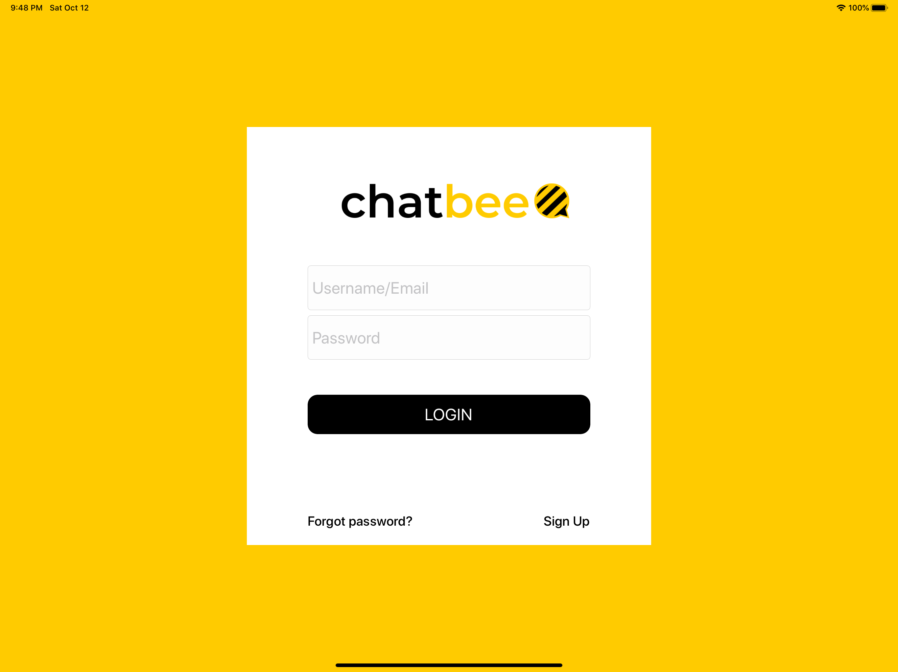
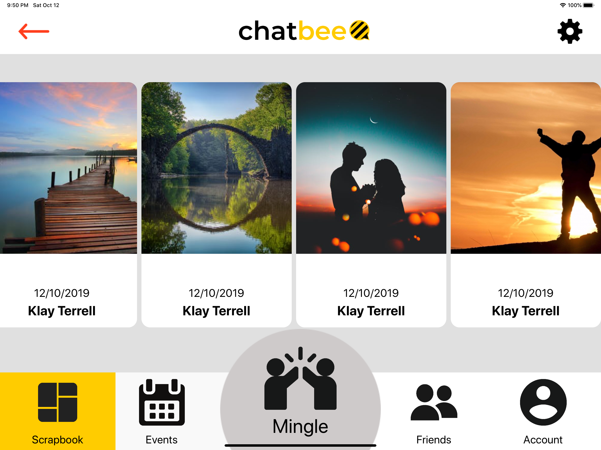
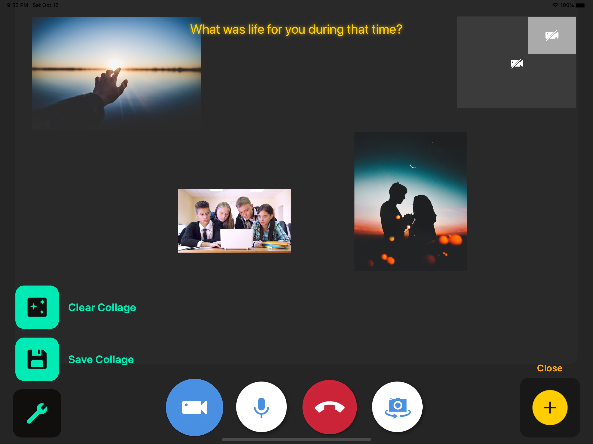
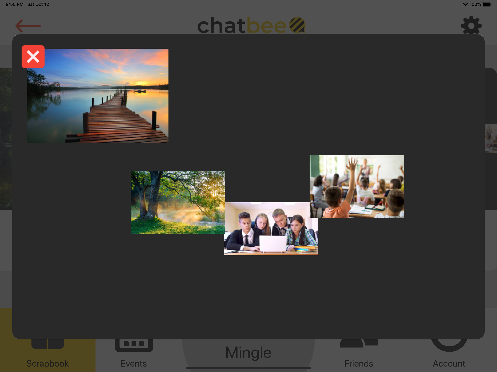

# Chatbee


## About the project

> This project has been renamed from "ScrapChat" to "Chatbee"

#### 1. Introduction

This is a design prototype for a proposed app created for the UTS Course: Advanced Interaction

Chatbee is an application that is designed with the target audience of elderly who are unable to connect with newer individuals. 
It serves as a tool for the elderly to converse with the younger generation or with potential friends on problems or expereinces 
that enables for the elder to reach out to new individuals. 




#### 2. The project

This app was developed using xCode targetted towards tablet users and utilised common technologies and solutions used 
amongst people to serve as familiar tools in communication. 

The application contains peer-to-peer video chat as a core component of the features within the application. Video chat, utilised 
the Agora.io libraries to develop more customisable implementation of video communication where traditional facetime was constricted 
with its default requirements and implementation. This was so it can enable scrapbooking, whilst in video call. Enabling picture-in-picture 
functionality between video chat and scrap-bookinbng.




### Prerequisites

> These prerequisites may be outdated due to stopped maintenance.

```
- XCode 11.0
- Agora.IO
- Cocoapods
- Firebase 
```

## Build With

* [xCode](https://developer.apple.com/xcode/) - Link to Apple Developer Page
* [Agora.IO](https://www.agora.io/en/developer-resources/) - Link to Developer Resources
* [Firebase](https://firebase.google.com/) - Link to Firebase homepage
* [Cocoapods](https://cocoapods.org/) - Link to Cocoapods homepage

## Authors

* **Jaiden Chicote** - [jChicote](https://github.com/jChicote)
* **Richard Christiansen** - [richardjchris](https://github.com/richardjchris)